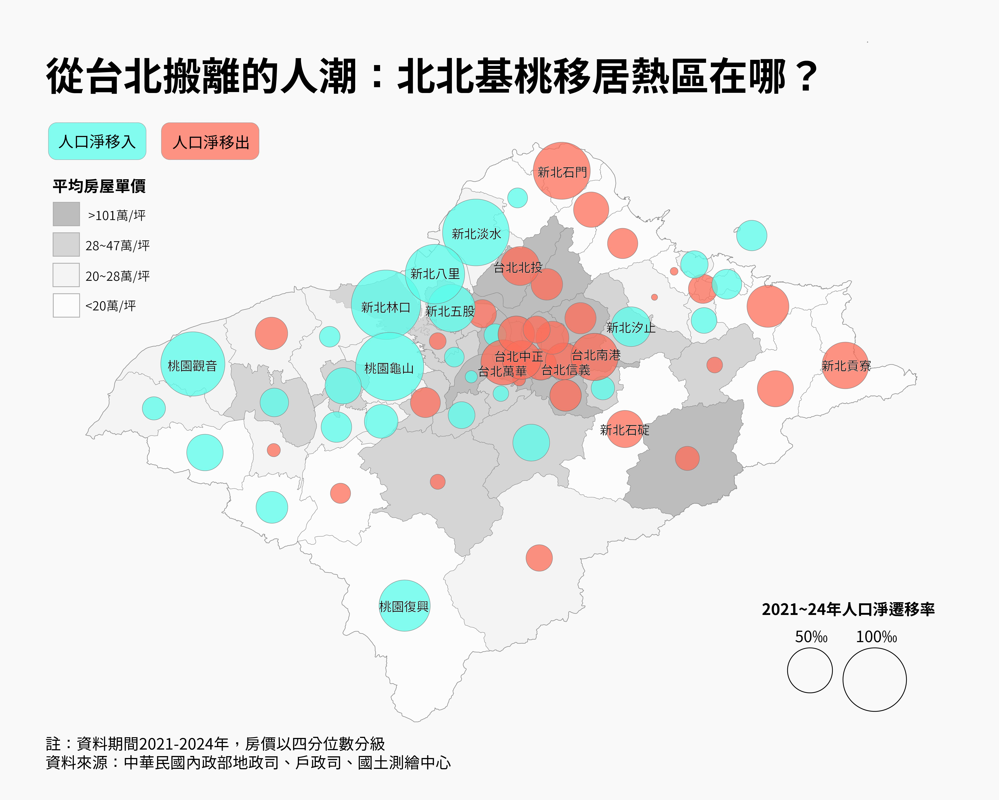

# TaiwanHousePrice-Movin&out

## 專案簡介
視覺化分析2021-2024年北北基桃各行政區人口遷移模式與房價關係

## 最終地理視覺化成果


## 主要發現
隨著北北基桃生活圈大眾運輸網建立，和2020年12月限貸令實施，人口明顯至台北市高房價地區，如台北萬華、南港、中正等區流出，新北淡水、八里、林口、五股、汐止以及桃園龜山、觀音、復興等地逐漸成為移居熱區，尤其林口、五股與汐止即便房價已在中高點，仍吸引人口遷居；反觀新北石門、石碇、貢寮等地雖然房價在低點，人口淨遷出比例仍高。

## 資料來源
- 內政部地政司（房屋實價登錄）
- 內政部戶政司（人口遷移資料）
- 內政部國土測繪中心（行政區界圖）

## 資料處理細節

- 房價資料來源為內政部2021年至2024年共552,385筆實價登錄資料，包含預售屋與成屋。
- 各行政區的「4年來平均房屋單價」為所有交易的「房屋單價（元/坪）」平均值。
- 房價分群依全體行政區平均房價的四分位數（Q25、Q50、Q75）分為低房價、中低房價、中高房價、高房價。
- 各行政區淨遷移率計算方式：
    - 4年總淨遷移 = 2021~2024年每年淨遷移人數加總（年度淨遷移 = 當年遷入總數 - 當年遷出總數）
    - 4年平均人口 = 2021~2024年每月人口平均
    - 4年淨遷移率（‰）= 4年總淨遷移 / 4年平均人口 × 1000

## 使用工具
- QGIS 3.x (地理資訊系統)
- Adobe Illustrator (視覺設計)
- Python (資料處理)

## 安裝與環境設置

```bash
# 建立資料夾結構
mkdir -p TaiwanHousePrice-MovinAndOut/{data/{raw,processed},notebooks,src,reports,tests}
cd TaiwanHousePrice-MovinAndOut

# 建立虛擬環境
python3 -m venv .venv
source .venv/bin/activate

# 安裝套件
pip install -r requirements.txt
```

## 專案結構
```
TaiwanHousePrice-MovinAndOut/
├── data/
│   ├── raw/
│   │   ├── MovInOut/   # 各縣市月度淨遷移資料
│   │   └── Popu/       # 各縣市月度總人口資料
│   └── processed/
│       ├── MovInOut/   # 處理後的遷移率資料
│       └── HousePrice/ # 處理後的房價資料
├── notebooks/
├── src/
│   ├── process_mov_in_out.py      # 人口遷移資料處理腳本
│   └── process_house_price.py     # 房價資料處理與分群腳本
├── reports/
├── tests/
├── visualization/         # 地理資料視覺化成果
├── .gitignore
├── requirements.txt
└── README.md
```

## 作者
Sammy Liu